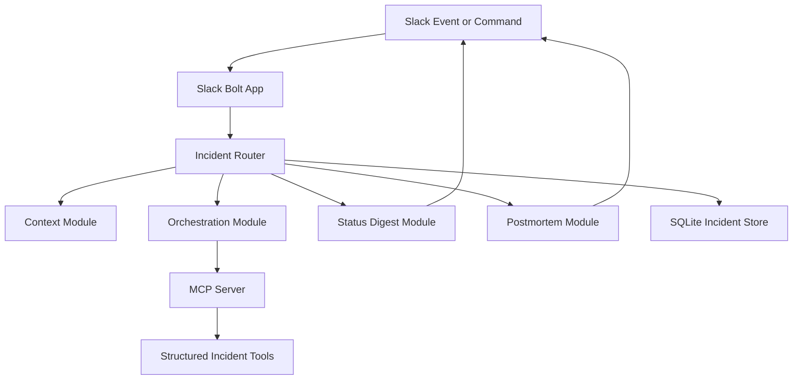

# Relay: Incident Commander for Slack

<p align="center">

  
  
  
  
</p>

<p align="center">
  <strong>A Slack-native incident coordination system that turns a severity message into structured response, ownership, status updates, and postmortem output.</strong>
</p>

Relay is built around the operational reality of high-pressure incidents: context must be gathered quickly, work must be assigned clearly, and leadership needs accurate updates without disrupting responders. The system coordinates Slack workflows, persistent state, task orchestration, and incident documentation from a single command surface.

## Core Capabilities

- Creates incident workflows directly from Slack conversations.
- Routes context, digest, orchestration, and postmortem responsibilities through separated modules.
- Maintains incident state and task records in SQLite.
- Integrates an MCP server for structured tool execution and response coordination.

## Technical Architecture

The repository contains a TypeScript Slack application and a companion MCP server. The main app handles Slack events, routing, state, and coordination modules, while the MCP server exposes structured incident operations over a separate process boundary.

## Architecture Diagram



## Technology Stack

- Slack Bolt for event handling and app integration.
- TypeScript and Node.js for strongly typed service code.
- SQLite for lightweight persistence.
- MCP SDK for tool-facing incident operations.
- Separated modules for context, digest, routing, orchestration, and postmortems.

## Repository Structure

- `src/app.ts` - Slack application entry point.
- `src/agents/orchestrator.ts` - Incident orchestration logic.
- `src/agents/postmortem.ts` - Postmortem generation workflow.
- `src/db.ts` - Application persistence layer.
- `mcp-server/src/index.ts` - MCP server entry point.
- `package.json` - Application scripts and dependencies.

## Getting Started

```bash
npm install
cd mcp-server && npm install
```

```bash
npm run dev
```

## Professional Context

This project shows backend product engineering for incident management, Slack operations, structured coordination, and service integration.
