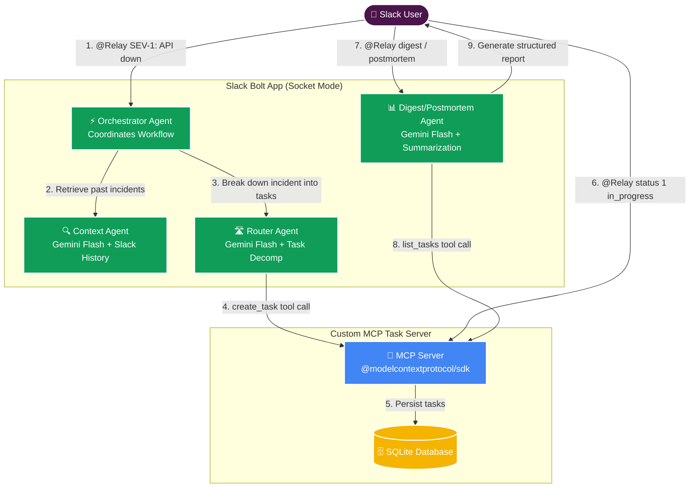

# Relay — AI Incident Commander for Slack

> *@Relay* is a Slack-native AI Incident Commander that turns a single `SEV-1` message into a fully coordinated incident response: context retrieval, war room creation, task generation via MCP, live status tracking, executive updates, and postmortem generation.

---

## 🏆 Devpost Submission Details

- **Hackathon Track:** New Slack Agent Track
- **Developer Sandbox URL:** `[https://slackaitryon.slack.com]` *(Note: Access has been granted to `slackhack@salesforce.com` and `testing@devpost.com`)*
- **Slack App ID:** `[A0BF1UKUW0J]` *(Proves submission/resubmission to the Slack Marketplace during the hackathon period)*
- **Updates during Hackathon:** This is a brand new application built entirely from scratch during the hackathon submission period.

---

## Architecture



**Tech stack:** Node.js · TypeScript · `@slack/bolt` · `@google/genai` (Gemini 2.5) · `@modelcontextprotocol/sdk` · SQLite

---

## Setup

### 1. Clone and install

```bash
npm install
cd mcp-server && npm install && cd ..
```

### 2. Configure environment

```bash
cp .env.example .env
# Fill in SLACK_BOT_TOKEN, SLACK_APP_TOKEN, GEMINI_API_KEY
```

### 3. Create a Slack App

1. Go to [api.slack.com/apps](https://api.slack.com/apps) → **Create New App** → **From Scratch**.
2. Under **OAuth & Permissions**, add Bot Token Scopes:
   - `app_mentions:read`
   - `chat:write`
   - `channels:history`
   - `channels:manage` (Required to create `#incident-` war room channels)
   - `groups:history`
3. Under **Event Subscriptions** → **Subscribe to bot events**: add `app_mention`.
4. Under **Socket Mode**: enable it. Generate an **App-Level Token** with `connections:write`.
5. Install the app to your workspace and copy `Bot User OAuth Token` → `SLACK_BOT_TOKEN`.
6. Copy the App-Level Token → `SLACK_APP_TOKEN`.

### 4. Run

```bash
npm run dev
```

The Slack Bolt app will automatically spawn the MCP Task Tracker server as a child process.

---

## Commands

| Command | Description |
|---|---|
| `@Relay SEV-<level>: <description>` | Declare a new incident — creates a war room, retrieves context, generates tasks |
| `@Relay digest [incident_id]` | Get the latest live executive status digest |
| `@Relay status <task_id> <todo\|in_progress\|done>` | Update a task's status in the MCP tracker |
| `@Relay postmortem [incident_id]` | Generate a structured postmortem from the channel history |

---

## Project structure

```
.
├── src/
│   ├── app.ts                  # Bolt app entry point + event routing
│   ├── db.ts                   # SQLite schema + queries (incidents)
│   ├── mcp-client.ts           # MCP client singleton (spawns mcp-server)
│   └── agents/
│       ├── orchestrator.ts     # Orchestrator Agent (sequence coordinator)
│       ├── context.ts          # Context Agent (RTS-style search + Gemini summary)
│       ├── router.ts           # Router Agent (Gemini JSON decomp + MCP create)
│       ├── digest.ts           # Digest Agent (MCP list + Gemini summary + Block Kit)
│       └── postmortem.ts       # Postmortem Agent (Channel history + Gemini summary)
├── mcp-server/
│   └── src/
│       ├── index.ts            # MCP server (create_task, list_tasks, update_task)
│       └── db.ts               # SQLite schema + queries (tasks)
├── data/                       # Auto-created — SQLite DB files (gitignored)
├── .env.example
└── package.json
```

---

## Data contract

```json
{
  "incident_id": "inc_1234567890_abc12",
  "title": "SEV-1: Payment API outage",
  "severity": "1",
  "incident_channel_id": "C0XXXXXXXXX",
  "description": "Payment API outage. Customers cannot complete checkout.",
  "context": [
    { "channel": "C0XXXXXXXXX", "ts": "1234567890.123456", "summary": "Prior outage discussion." }
  ],
  "tasks": [
    {
      "task_id": "1",
      "title": "Investigate Payment API logs",
      "assignee_slack_id": null,
      "external_ref_id": "1",
      "status": "todo",
      "due_date": null
    }
  ],
  "last_digest_ts": null
}
```
